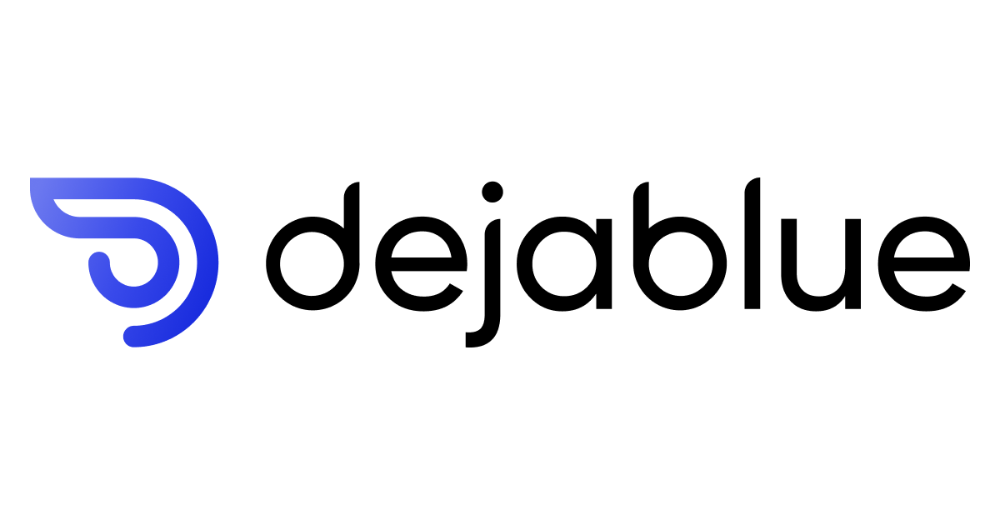
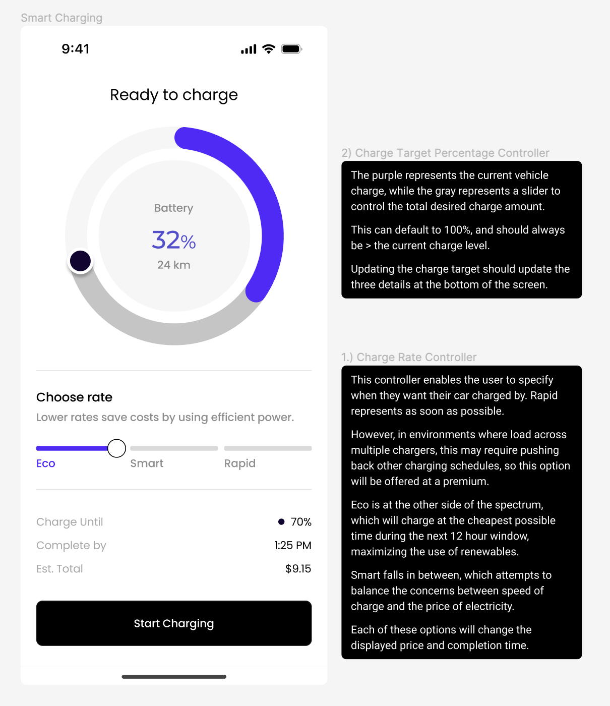
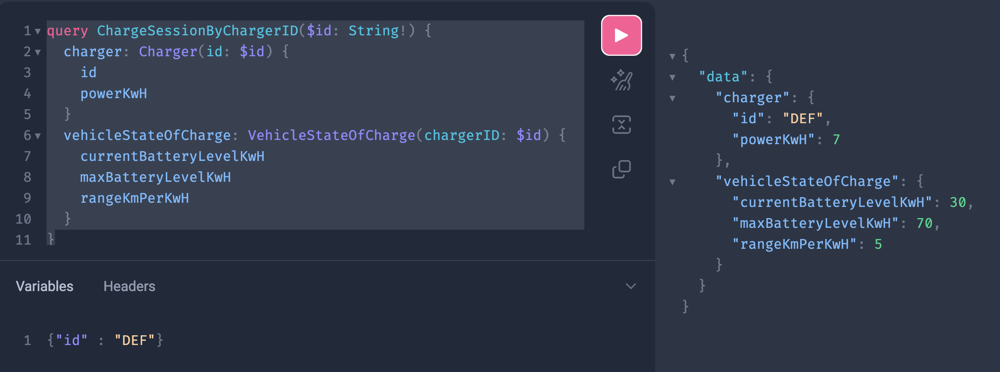
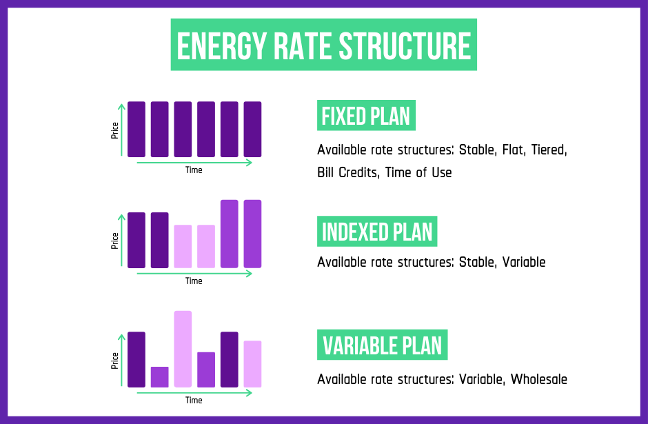
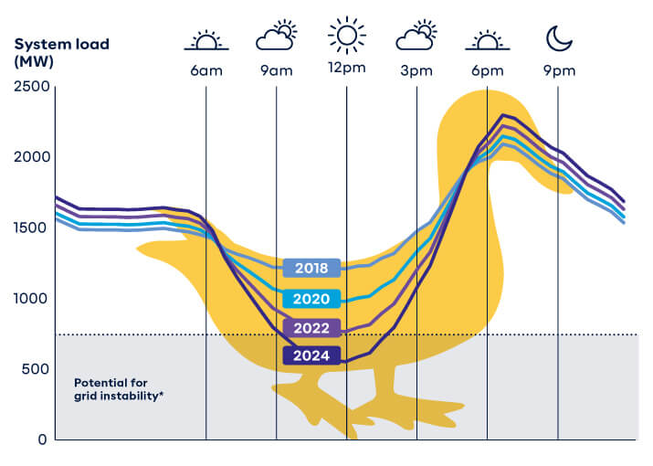

## DejaBlue Software Interview

Hey!

If you are reading this, we are really excited about you joining our team here at [DejaBlue](www.dejablue.energy)! We are laser focused on turning electric vehicles into the largest distributed energy asset in the connected grid and looking for great people to join our team.


We designed this take-home exercise to:

1. Learn as much as we can about how you work.
2. Require as little of your time as possible.
3. Introduce you to the types of challenges you might encounter in this role.

This is intended to be a lightweight, full-stack exercise. It should take 3-5 hours depending on your familiarity the different components. For the exercises, we created a reduced form of our software stack: Golang on the backend, Typescript (Next JS for web tooling & React Native for our actual app) on the frontend. It is intended to resemble as much of a real world environment as possible. Feel free to use all of the resources that are normally at your disposal for your engineering work, but please complete it yourself (ex. no outsourcing).

Below, you'll find the exercises we've chosen to represent the work you may encounter in this role. There is not necessarily a single right answer to some of these — we've left these intentionally open-ended to see how you think.

Please note, this a fully fictitious exercise, based upon the larger EV charging domain, that was built specifically for this coding exercise - and will not be leveraged by DejaBlue for any purposes other than assessing your work.

The exercises are structured in graduating order to try and maximize your exposure within this time.

**We tried to design this to be a fun experience for you. We hope you enjoy the exercises.**

### **Instructions**:
1. Clone the repo
2. Complete the exercises
3. Create a quick Loom (or similar) walking us through your solution design and prototype. This is your opportunity for you to share the reasoning behind the design and implementation designs you made.
4. Send your submission to [software-interview-submission@dejablue.energy](mailto:software-interview-submission@dejablue.energy). We will go review this and give personalized feedback for every submission.

**Please do not fork the repository**. We want to keep your solution yours, since other applicants will be doing the same exercise.

*Alternatively, if you have a GitHub repo or other work that you think clearly demonstrates all the same skills presented in this exercise, even to those unfamiliar with the code base, you are welcome to send that to us instead.*

Last, if you have any questions, don't hesitate to reach out to "parker" at "dejablue.energy".

### Exercises
We created a sandbox environment for you that should be ready to go out of the box! (Let us know if you run into any issues.) Here are all of the details for [local development environment](#development-environment).

The tasks are broken down into segments. Please try to complete at least three of these tasks in the given time.

1. [Task 1: Implement the charge rate controller](#task-1-implement-the-charge-rate-controller)
- Focus areas:
    - UI implementation
    - Familiarity across the stack
2. [Task 2: Implement a variable tariff pricing policy](#task-2-implement-a-variable-tariff-pricing-policy)
- Focus areas:
    - GraphQL / API design
3. [Task 3: Calculate the optimal charge start and end time](#task-3-calculate-the-cheapest-time-to-charge-within-the-next-12-hours)
- Focus area: algorithm design and testing
4. [Task 4: Update the UI based on charger state](#task-4-update-the-ui-based-on-charger-state)
- Focus areas:
    - Concurrency
    - Front-end components reacting to changes to data state
5. [Task 5: Complete the UI from Task 1](#task-5-complete-the-ui-from-task-1)
    - Focus area: non-standard UI components

#### **Task 1:** Implement the charge rate controller.

Please see the instructions in [Figma](https://www.figma.com/file/1bcKFWLdkF7FFnxvOQDXzP/Charge-Interview-Loop?type=design&node-id=0%3A1&mode=design&t=zLZRlm80RNMYHsfp-1) and take advantage of Developer mode. Note that the charge rate controller is the bottom portion of the screen. All of the plumbing to connect the frontend to the backend is setup; your jumping off point to make the UI changes lies [here](./src/app/charge/[chargerID]/page.tsx).



- You may consider augmenting the [endpoints](graphql/charge.graphql) to calculate the estimated price and time of completion for the charge rates. You can use a constant rate of 25, 30, and 40 cents per kWh for the three [charge rates](./go/pkg/charge/pricing.go). Look at the implementation of the other queries to replicate the structure and refer to the [GraphQL code generation instructions](#graphql-generation).

The backend is already seeded with [a few chargers in different states](go/main.go). You have access to the [graphQL playground as well](#server). The charger with the ID "ABC"  is in the "Available" state and the ID "DEF" corresponds to a charger with a vehicle plugged in.



- We will cover the interactive UI in the top portion (`charge target percentage controller`) in the final [task](#task-5-complete-the-rest-of-the-ui-from-task-1). For now, put in a placeholder that will work and display the appropriate data. As a startup, it is important that we know which tradeoffs we can take, so that we spend our time focused on the highest impact areas and build sequentially toward our larger goals.

#### **Task 2:** Implement a variable tariff pricing policy.

Design a [pricing system](go/pkg/charge/pricing.go) with tests that accounts for tariffs that are time of day and day of week dependent, and return these prices based upon:
- Peak: 5pm to 9pm weekdays
    - **$0.40 / kWh**
- Shoulder: 7am to 5pm and 9pm to 10pm weekdays, 7am to 10pm on weekends
    - **$0.30 / kWh**
- Off-peak: 10pm to 7am every day
    - **$0.25 / kWh**

This system should replace the prior pricing policy. Please connect this to the front end app.

Motivating background information:


In many markets, users pay [different prices](https://www.chooseenergy.com/energy-resources/energy-buying-guide/) of electricity (changing on a per hour basis), based upon the time of day. This is due to imbalances in supply and demand, exasperated with the growing renewable penetration. Typically, energy is most prevalent and cheapest during the day, when thermal wind and solar generation are at full force, while in the evenings, renewable generation is low and there is the highest energy demand as everyone returns home (and plugs in their EV!). This phenomenon is referred to as the [duck curve](https://www.synergy.net.au/Blog/2021/10/Everything-you-need-to-know-about-the-Duck-Curve).



Markets with variable pricing often use this as a financial incentive to charge when energy is cheapest to produce and consume (and the times during which there is often a large share of renewable generation).


#### **Task 3:** Calculate the cheapest time to charge within the next 12 hours

For ECO mode, and assuming a max power charge level and continuous amount for the duration of the charge, calculate the optimal charge start and end time within the next 12-hour period.

#### **Task 4:** Enable your UI to respond to the real world event of a vehicle plugging into / being unplugged from a charger.

EV charging plays at the fun intersection of software <> physical things in the real world environment. This requires our systems to respond to real world events and update the UI accordingly.

Update the UI to a new screen asking the user to plug in if the charger state changes to "available". *Hint*: we don't want to see a polling loop mechanism here, see what you can take advantage of with GraphQL structures.

First, on the backend, you will need to implement the [resolver](./go/pkg/gen/gql/resolver/charge.resolvers.go) to stream the information to the client. If you are new to this topic, there are some good online resources about [channels and concurrency](https://medium.com/goturkiye/concurrency-in-go-channels-and-waitgroups-25dd43064d1), and you might find other useful references in the codebase. Once this is in a good state, you will be able to test this end to end with data live updating on the client.

All of the wiring between the front and backend is complete. In the same [file]([here](./src/app/charge/[chargerID]/page.tsx) that you made the initial changes for the UI; there is a second function that enables you to subscribe to charger changes. Attach that to your UI somewhere and you will seem streamed values as the state updates.

Once you get here, you may consider updating the API to something that fits your desired implementation for this last task - the initial subscription is here to help you quickly get there.

The Apollo client has more documentation about working with [subscriptions](https://www.apollographql.com/docs/react/data/subscriptions/) to update components. For this exercise, use the charger "GHI", which was [set up to update its state](./go/main.go) quickly to ease testing. Feel free to modify anything as you see fit.

#### **Task 5** Complete the rest of the UI from **Task 1**

Complete the UI from **Task 1** by building out the `charge target percentage controller`.

### Closing Thoughts

In all of this, we want to make this feel like a real world environment, which we believe strongly is a team environment. We aim to be a world class team, competing at a professional level; in order to be at that level we are committed to helping each other and fostering a strong, collaborative environment. If you are stuck or have any questions as you go through this, please don't hesitate to reach out. We are more than happy to provide pointers.

We hope that this exercise was a fun way for you to get a sense of how we work, exposure to an emulation of our tech stack, and familiarity with the types of problems we are building solutions for.

We would welcome your feedback with your exercise submission:
- approximately how much time did you spend on the overall exercise and each of the tasks?
- how did you find the tasks? any feedback?

Thank you for your time and consideration!

## Development Environment

*Note: this is an active repo, and like any other project, you may encounter small things that don't work quite right or need a slight adjustment. We encourage you to let us know or make the small fix so we can offer the best experience to subsequent interviewers.*

To get started, install the developer tooling for the exercise:
- In the project root folder, run `make setup-mac`.

(If you don't have a mac, please see the [asdf install documentation](https://asdf-vm.com/guide/getting-started.html#_2-download-asdf).)

### Server:
```bash
make run-go-backend
```
Note that this server needs to be restarted for changes to take effect and does not hot reload like the client.

Open [http://localhost:8080](http://localhost:8080) with your browser. This will open to the GraphQL playground.

Backend unit tests can be run with
```bash
make test-unit-go
```

#### GraphQL generation
GraphQL generation is included in the above two make commands, and can be ran manually in development with:
```bash
make gen-gql
```

### Client:
```bash
make run-client
```

Open [http://localhost:3000](http://localhost:3000) with your browser to run the client.

## Learn More

To learn more about *Next.js*, take a look at the following resources:

- [Next.js Documentation](https://nextjs.org/docs) - learn about Next.js features and API.
- [Learn Next.js](https://nextjs.org/learn) - an interactive Next.js tutorial.
- [Tailwind CSS Documentation](https://tailwindcss.com/docs/installation)


To learn more about *GraphQL*, take a look at the following resources:

- [Learn GraphQL](https://graphql.org/learn/) - learn about GraphQL types and query patterns

To learn more about *Golang*, take a look at the following resources:

- [Documentation](https://go.dev/doc/) - jumping off point for general documentation
- [Golang Tour](https://go.dev/tour/welcome/1) - learn by doing
- [Go by Example](https://gobyexample.com/) - examples of common things
